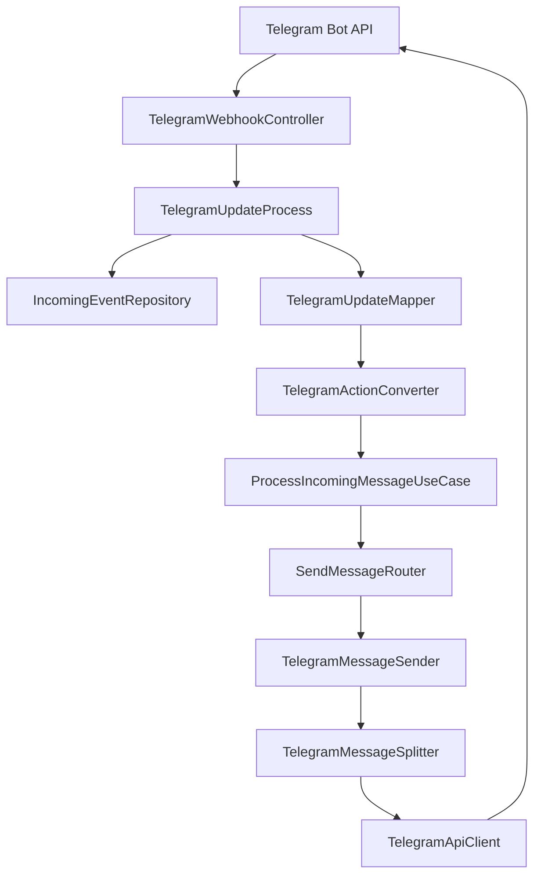

# BlueMemo API

BlueMemo is the backend for a personal conversational assistant. The current implementation includes user identity/task management plus the first Telegram messaging deliveries:

- **BM-01 — Telegram inbound/outbound messaging** — closed
- **BM-02 — Telegram operational reliability** — closed
- **BM-03 — Telegram ↔ BlueMemo identity linking** — implemented and verified; PR #10 merge pending

BM-03 links a Telegram identity to an existing JWT-authenticated BlueMemo user. It does **not** authorize Tools or personal provider actions; that belongs to BM-04.

## Tech stack

- Java 17
- Spring Boot 4.1.0
- Spring Web MVC + `RestClient`
- Spring Security + JWT
- Spring Data JPA / Hibernate
- PostgreSQL 17
- Flyway
- JUnit / Mockito / MockMvc / MockWebServer
- PostgreSQL Testcontainers
- JaCoCo
- Docker / Docker Compose
- GitHub Actions CI

## Core API

BlueMemo currently provides:

- user registration/login;
- BCrypt password hashing;
- stateless JWT authentication;
- profile retrieval, update and deletion;
- per-user Todo CRUD;
- Telegram inbound/outbound messaging;
- persistent Telegram inbound-event idempotency;
- Unicode-safe Telegram message fragmentation;
- Telegram ↔ BlueMemo identity linking, inspection, revocation and resolution.

## BM-03 — Telegram identity linking

### REST endpoints

| Method | Path | Authentication | Behavior |
| --- | --- | --- | --- |
| `POST` | `/users/me/link/channel/TELEGRAM` | JWT | Requires `{"consent":true}` and returns `linkUrl` + `expirationDate` |
| `GET` | `/users/me/link/channel/TELEGRAM` | JWT | Returns the authenticated user's link history, newest first |
| `DELETE` | `/users/me/unlink/channel/TELEGRAM` | JWT | Revokes the active Telegram link, preserves history and invalidates pending tokens |

A generated link token:

- contains 256 random bits from `SecureRandom`;
- expires after 10 minutes;
- is one-time;
- is persisted only as a SHA-256 hash;
- stores explicit consent metadata (`consentedAt`, `consentVersion=1`).

Only a private Telegram chat can complete `/start <token>`. The association stores Telegram external user and conversation separately. A valid token is consumed before final ownership/conflict checks; if a conflict prevents creation, the token remains consumed by design.

Revocation keeps the historical `channel_accounts` row and populates `revokedAt`. A revoked association stops resolving immediately. Relinking requires a fresh verified token and creates a new active history row.

`ChannelIdentityResolver` resolves a BlueMemo user only when channel, external user and conversation match an active association.

### Telegram commands

Telegram-specific command syntax is interpreted inside the Telegram adapter and converted to channel-independent `IncomingAction` values before shared processing.

| Telegram input | Generic action | Behavior |
| --- | --- | --- |
| regular text | `MESSAGE` | Replies `Recibí <text>` |
| `/start` | `WELCOME` | Replies `Bienvenido, soy un bot` |
| `/start <token>` | `LINK_CHANNEL` | Attempts Telegram ↔ BlueMemo linking |
| `/check-link` | `CHECK_CHANNEL_LINK` | Reports linked/unlinked state in private chat without exposing BlueMemo UUID |
| `/help` | `HELP` | Returns the current help response |
| unknown slash command | `UNKNOWN_COMMAND` | Replies `Comando no reconocido` |

`TelegramCommands` / `TelegramActionConverter` own Telegram command parsing. `ProcessIncomingMessageService` consumes `IncomingAction`; it does not parse Telegram command strings.

### Consent and audit

Consent version `1` means consent to associate the Telegram identity/conversation with the BlueMemo account for identity resolution. It is not permission to execute Tools. Clients must explicitly request consent before sending `consent:true`.

Audit/history fields include:

- `linkedAt`;
- `revokedAt`;
- `consentedAt`;
- `consentVersion`.

Deleting the BlueMemo user is a separate use case from unlinking: account deletion removes all channel associations/history, all link tokens, todos and finally the user within one transaction.

## Telegram messaging architecture



Responsibilities:

| Component | Responsibility |
| --- | --- |
| `TelegramWebhookController` | Validates the Telegram webhook secret and acknowledges requests |
| `TelegramUpdateProcess` | Rejects unsupported updates, registers events and prevents duplicate processing |
| `TelegramUpdateMapper` | Maps Telegram DTOs into channel-independent messages/events |
| `TelegramActionConverter` | Converts Telegram command syntax into generic `IncomingAction` |
| `ProcessIncomingMessageService` | Executes generic action behavior and manages processing status |
| `SendMessageRouter` | Selects a channel sender by `ChannelType` |
| `TelegramMessageSender` | Splits/validates ordered Telegram outbound fragments |
| `TelegramMessageSplitter` | Enforces Telegram's 4096-code-point message limit safely |
| `TelegramApiClient` | Calls Telegram Bot API through `RestClient` |

## Telegram webhook

### Endpoint

```http
POST /webhooks/telegram
X-Telegram-Bot-Api-Secret-Token: <secret>
Content-Type: application/json
```

The route is public in Spring Security but authenticates Telegram through the secret header; it does not require a BlueMemo JWT.

A supported update requires:

- `update_id`;
- `message.message_id`;
- `message.date`;
- `message.chat.id`;
- `message.from.id`.

Updates without `message` or required identifiers are acknowledged with `200 OK` and no outbound request. `message.text` may be absent; the current fallback is `De momento solo proceso texto`.

## Incoming-event idempotency and lifecycle

Supported Telegram updates are registered in PostgreSQL before processing. The idempotency key is:

```text
(channel_type, external_event_id)
```

For Telegram, `external_event_id` is the Telegram `update_id`. Inserts use PostgreSQL `ON CONFLICT DO NOTHING`; duplicate updates are acknowledged but not processed/sent again.

Normal lifecycle:

```text
RECEIVED → PROCESSING → PROCESSED → ANSWERED
```

`FAILED` represents a runtime failure during reply generation/processing or outbound delivery. `ProcessIncomingMessageService` wraps reply generation and sending in the failure lifecycle so failures do not remain incorrectly stuck in `PROCESSING` merely because they occurred before the outbound call.

Idempotency is persistent across application restarts and shared instances using the same database, but it is not a distributed exactly-once guarantee across PostgreSQL and Telegram.

### Incoming-event retention

The defined retention policy is 30 days from `received_at`. Automatic scheduled cleanup is not currently implemented; deletion is operational when required. Deleting an idempotency row also removes the duplicate-detection history for that update.

## Telegram outbound fragmentation

Telegram text is limited to 4096 Unicode code points per message. This constraint remains inside the Telegram adapter.

The splitter:

- uses Unicode code-point-aware operations (`codePointCount`, `offsetByCodePoints`);
- does not split UTF-16 surrogate pairs such as emoji;
- prefers nearby line-break/space boundaries within 50 code points of the limit;
- otherwise performs a hard split at 4096 code points;
- preserves complete original content;
- preserves fragment order and the same `chat_id`;
- stops after the first failed fragment;
- leaves the incoming event `FAILED` on outbound failure.

Previously accepted fragments cannot be rolled back and individual fragments are not automatically retried.

## Flyway migrations

Flyway applies pending migrations before Hibernate schema validation.

BM-03 persistence uses:

- **V4** — creates channel-link token/account tables;
- **V5** — adds consent/revocation fields, active-only unique indexes and invalidates unused pre-consent tokens.

V4 was not rewritten after V5 was introduced. Existing associations are preserved without fabricating historical consent. Pre-existing ambiguous active conversations cause V5 to fail rather than silently reassign/delete ownership.

Do not edit already shared/applied migrations; add a new migration instead.

## Environment variables

| Variable | Required | Default | Description |
| --- | --- | --- | --- |
| `JWT_SECRET` | Yes | None | Base64-encoded JWT signing secret |
| `JWT_EXPIRATION_MS` | No | `900000` | JWT lifetime in milliseconds |
| `TELEGRAM_BOT_TOKEN` | Yes | None | Bot token issued by BotFather |
| `TELEGRAM_WEBHOOK_SECRET` | Yes | None | Telegram webhook secret header value |
| `TELEGRAM_BOT_NAME` | Yes | None | Bot username used to generate deep links, e.g. `BlueMemoAppDevBot` |
| `SERVER_PORT` | No | `8080` | Internal application port |
| `SPRING_DATASOURCE_URL` | QA/Prod | Local PostgreSQL URL | JDBC datasource URL |
| `SPRING_DATASOURCE_USERNAME` | QA/Prod | `app_user` locally | Database username |
| `SPRING_DATASOURCE_PASSWORD` | QA/Prod | `user` locally | Database password |
| `FLYWAY_DATABASE_URL` | QA/Prod | None | Optional Flyway-specific JDBC URL |
| `FLYWAY_DATABASE_USERNAME` | No | Datasource username | Optional Flyway-specific username |
| `FLYWAY_DATABASE_PASSWORD` | No | Datasource password | Optional Flyway-specific password |
| `DB_MAX_POOL_SIZE` | No | `10` | Production Hikari max pool size |
| `DB_MIN_IDLE` | No | `2` | Production Hikari minimum idle connections |

Never commit real credentials, JWTs, Telegram bot tokens, webhook secrets, link tokens or token hashes.

### Docker Compose `.env`

Create `bluememo/.env`:

```dotenv
POSTGRES_DB=bluememo_db
POSTGRES_USER=app_user
POSTGRES_PASSWORD=replace_with_a_strong_password
JWT_SECRET=replace_with_a_base64_encoded_secret
TELEGRAM_BOT_TOKEN=replace_with_the_development_bot_token
TELEGRAM_WEBHOOK_SECRET=replace_with_the_webhook_secret
TELEGRAM_BOT_NAME=BlueMemoAppDevBot
```

The `.env` file is ignored by Git.

## Spring profiles

| Profile | Database | Purpose |
| --- | --- | --- |
| `local` | PostgreSQL local/default overrides | Local development / Docker Compose |
| `qa` | PostgreSQL via environment | QA |
| `prod` | PostgreSQL via environment | Production |
| `test` | PostgreSQL Testcontainer | Automated integration tests |

## Running with Docker Compose

From the repository root:

```bash
cd bluememo
docker compose up --build -d
```

Docker exposes:

- API: `http://localhost:8000`
- Swagger UI: `http://localhost:8000/swagger-ui.html`
- OpenAPI JSON: `http://localhost:8000/v3/api-docs`
- health: `http://localhost:8000/actuator/health`

Useful commands:

```bash
docker compose logs -f api
docker compose down
```

`docker compose down -v` also deletes the local PostgreSQL volume.

## Running directly

### Windows PowerShell

```powershell
cd bluememo

$env:SPRING_DATASOURCE_URL = "jdbc:postgresql://localhost:5432/bluememo_db"
$env:SPRING_DATASOURCE_USERNAME = "app_user"
$env:SPRING_DATASOURCE_PASSWORD = "replace_with_a_strong_password"
$env:JWT_SECRET = "replace_with_a_base64_encoded_secret"
$env:TELEGRAM_BOT_TOKEN = "replace_with_the_development_bot_token"
$env:TELEGRAM_WEBHOOK_SECRET = "replace_with_the_webhook_secret"
$env:TELEGRAM_BOT_NAME = "BlueMemoAppDevBot"

.\mvnw.cmd spring-boot:run "-Dspring-boot.run.profiles=local"
```

### Linux/macOS

```bash
cd bluememo

export SPRING_DATASOURCE_URL=jdbc:postgresql://localhost:5432/bluememo_db
export SPRING_DATASOURCE_USERNAME=app_user
export SPRING_DATASOURCE_PASSWORD=replace_with_a_strong_password
export JWT_SECRET=replace_with_a_base64_encoded_secret
export TELEGRAM_BOT_TOKEN=replace_with_the_development_bot_token
export TELEGRAM_WEBHOOK_SECRET=replace_with_the_webhook_secret
export TELEGRAM_BOT_NAME=BlueMemoAppDevBot

./mvnw spring-boot:run -Dspring-boot.run.profiles=local
```

Direct execution exposes port `8080`; Docker Compose maps the API to host port `8000`.

## Exposing/registering the development Telegram webhook

For quick local development with Docker Compose:

```bash
cloudflared tunnel --url http://localhost:8000
```

For direct Maven execution, expose `http://localhost:8080` instead.

Linux/macOS webhook registration:

```bash
curl -X POST "https://api.telegram.org/bot${TELEGRAM_BOT_TOKEN}/setWebhook" \
  -H "Content-Type: application/json" \
  -d "{\"url\":\"https://YOUR_TUNNEL_URL/webhooks/telegram\",\"secret_token\":\"${TELEGRAM_WEBHOOK_SECRET}\",\"allowed_updates\":[\"message\"]}"
```

Windows PowerShell:

```powershell
$body = @{
    url = "https://YOUR_TUNNEL_URL/webhooks/telegram"
    secret_token = $env:TELEGRAM_WEBHOOK_SECRET
    allowed_updates = @("message")
} | ConvertTo-Json

curl.exe -X POST `
  "https://api.telegram.org/bot$env:TELEGRAM_BOT_TOKEN/setWebhook" `
  -H "Content-Type: application/json" `
  -d $body
```

## Main REST endpoints

| Method | Endpoint | Authentication | Description |
| --- | --- | --- | --- |
| `POST` | `/webhooks/telegram` | Telegram secret | Receives Telegram updates |
| `POST` | `/auth/register` | Public | Registers a BlueMemo user |
| `POST` | `/auth/login` | Public | Authenticates and returns JWT |
| `GET` | `/users/me` | JWT | Retrieves authenticated profile |
| `PATCH` | `/users/me` | JWT | Partially updates profile |
| `DELETE` | `/users/me` | JWT | Deletes user plus dependent todos/link tokens/channel history transactionally |
| `POST` | `/users/me/link/channel/TELEGRAM` | JWT | Generates Telegram link token/deep link with explicit consent |
| `GET` | `/users/me/link/channel/TELEGRAM` | JWT | Returns own Telegram association history |
| `DELETE` | `/users/me/unlink/channel/TELEGRAM` | JWT | Revokes own active Telegram association |
| `POST` | `/todos` | JWT | Creates Todo |
| `GET` | `/todos` | JWT | Lists Todos |
| `GET` | `/todos/{todoId}` | JWT | Retrieves owned Todo |
| `PUT` | `/todos/{todoId}` | JWT | Updates Todo content |
| `PATCH` | `/todos/{todoId}?status={status}` | JWT | Updates Todo status |
| `DELETE` | `/todos/{todoId}` | JWT | Deletes owned Todo |

Canonical Todo statuses are `PENDING`, `IN_PROGRESS`, and `DONE`; `COMPLETED` is accepted as an alias for `DONE`.

## Testing

Run from `bluememo/`. Docker must be running because persistence integration tests use PostgreSQL Testcontainers.

Windows:

```powershell
.\mvnw.cmd clean verify
```

Linux/macOS:

```bash
./mvnw clean verify
```

The latest recorded local BM-03 verification passed **123 tests with 0 failures, 0 errors and 0 skipped**. Coverage includes Telegram command conversion, identity linking/revocation, concurrency, migration V4→V5 and application-context recreation against persistent PostgreSQL state.

GitHub Actions uses:

```bash
./mvnw --batch-mode --no-transfer-progress clean verify
```

for PRs targeting `main`, pushes to `main` and manual runs. CI run #30 completed successfully for functional verification anchor `745a980a`; after any later documentation-only commit, check the PR's current HEAD before claiming final CI status.

The JaCoCo report is generated at:

```text
bluememo/target/site/jacoco/index.html
```

## BM-03 verification evidence

In addition to automated tests, the real development Telegram bot (`@BlueMemoAppDevBot`) was manually exercised against the local API/PostgreSQL database. Verified behavior includes:

- `/check-link` reports unlinked before association;
- generation and consumption of a real deep-link token;
- successful `/start <token>` linking;
- persisted hash-only token and consent metadata;
- active identity resolution;
- history inspection;
- unlink with `204` and preserved `revokedAt` history;
- immediate unlinked status after revocation;
- invalidation of a pending unused token;
- fresh relinking with a new token and preserved old history;
- persistence of active/revoked state after application restart;
- Flyway schema version 5 validated as up to date after restart.

See `docs/codex/PROJECT_STATE.md`, `docs/codex/ACTIVE_BM03.md`, `docs/codex/DECISIONS.md` and `docs/codex/ROADMAP.md` for the maintained project context.

## Delivery status

BM-03 is functionally implemented and verified. PR #10 remains the closure boundary. Before merge, confirm the **current PR HEAD** has green CI and no blocking review findings. After merge, BM-03 can be marked closed and BM-04 becomes the active delivery.
