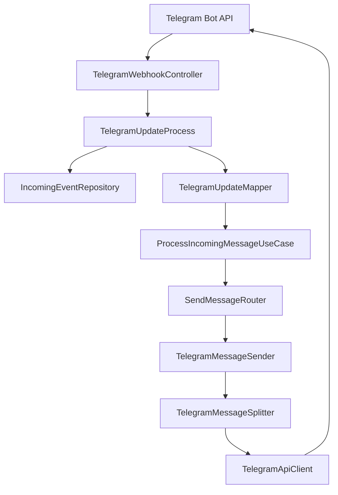

# BlueMemo API

BlueMemo is the backend for a personal conversational assistant. The current implementation provides identity and task management together with the first Telegram messaging deliveries:

- **BM-01 — Telegram inbound and outbound messaging**
- **BM-02 — Telegram reliability**

BM-01 receives Telegram updates through a protected webhook, converts supported messages into a channel-independent model, processes them, routes the response to the correct channel, and sends the reply through the Telegram Bot API.

BM-02 adds persistent idempotency for inbound Telegram updates and safe fragmentation for outbound messages that exceed Telegram's message-size limit.

## Current Scope

### BM-03 — Telegram identity linking (active)

BM-03 links a Telegram identity to an existing JWT-authenticated BlueMemo user. It does not authorize Tools or personal provider actions. The current working implementation uses:

| Method and path | Behavior |
| --- | --- |
| `POST /users/me/link/channel/TELEGRAM` | Requires JSON `{"consent":true}`. Returns `linkUrl` and `expirationDate`. Rejects an already active link with 409. |
| `GET /users/me/link/channel/TELEGRAM` | Returns the authenticated user's association history, including `linkedAt`, `revokedAt`, `consentedAt` and `consentVersion`. A null `revokedAt` means active. |
| `DELETE /users/me/unlink/channel/TELEGRAM` | Revokes the user's active Telegram association and invalidates outstanding Telegram link tokens; returns 204, including when already unlinked. |

All three endpoints require a BlueMemo JWT. Consent version `1` means consent to associate the Telegram identity/conversation with the BlueMemo account for identity resolution; it is not permission to execute Tools. Clients must ask explicitly before sending `consent:true`.

Open the returned deep link with the configured Telegram bot (`TELEGRAM_BOT_NAME`). Only a private-chat `/start <token>` can complete linking. The random 256-bit token expires in 10 minutes; only its SHA-256 hash is stored. An attempted link that reaches ownership checks consumes the token even if ownership conflicts prevent creation. External user and conversation are separate identifiers.

Revocation preserves history and immediately stops identity resolution. Linking again requires a new token and explicit consent. Full BlueMemo account deletion removes all its tokens and associations/history, along with todos, in one transaction.

Flyway V5 adds consent/revocation fields and active-only unique indexes without changing V4. It invalidates unused legacy tokens and leaves historical consent null rather than inventing consent. Existing active links remain active. Duplicate pre-existing active conversations must be reviewed before migration; V5 does not silently reassign ownership.

`ChannelLinkIntegrationTest` verifies this flow with PostgreSQL Testcontainers and MockMvc, including concurrency, owner isolation, revocation, hash-only storage and cleanup rollback. Real dev-bot E2E and CI for the final commit remain required before BM-03 closure. See `docs/codex/PROJECT_STATE.md` and `docs/codex/DECISIONS.md`.

### Core API

- User registration and login
- BCrypt password hashing
- Stateless JWT authentication
- Profile retrieval, partial update, and deletion
- Per-user task CRUD
- Pagination, filtering, and sorting
- Centralized error handling
- PostgreSQL persistence and Flyway migrations

### BM-01 — Telegram

- Public `POST /webhooks/telegram` endpoint
- Webhook authentication through `X-Telegram-Bot-Api-Secret-Token`
- Telegram update deserialization and validation
- Mapping to channel-independent `IncomingMessage` and `OutgoingMessage` models
- Message-channel routing through `SendMessageRouter`
- Telegram Bot API integration through `RestClient`
- Five-second connection timeout and ten-second read timeout
- Text and basic command processing
- Safe acknowledgement of unsupported or incomplete updates
- Integration tests with MockMvc and MockWebServer
- Router tests for Telegram, WhatsApp, and unconfigured channels

### BM-02 — Telegram Reliability

- Persistent inbound-event registration in PostgreSQL
- Idempotency by `(channel_type, external_event_id)`
- Atomic duplicate protection through a database unique constraint and `ON CONFLICT DO NOTHING`
- Incoming-event lifecycle tracking
- Telegram message fragmentation above 4096 Unicode code points
- Unicode code-point-aware splitting
- Natural split points using line breaks and spaces
- Maximum natural-split distance of 50 code points from the Telegram limit
- Ordered sequential delivery of fragments
- Same `chat_id` preserved across all fragments
- Stop-on-failure behavior for partial fragment delivery
- Failed outbound delivery recorded with `FAILED` event status
- Retention policy defined for `incoming_events`

WhatsApp is represented as a channel type to validate the routing abstraction, but it does not have an adapter yet.

## Architecture

The messaging flow separates Telegram-specific infrastructure from the shared application flow:



Responsibilities:

| Component | Responsibility |
| --- | --- |
| `TelegramWebhookController` | Validates the webhook secret and acknowledges the request |
| `TelegramUpdateProcess` | Rejects unsupported updates, registers incoming events, and prevents duplicate processing |
| `TelegramUpdateMapper` | Converts valid Telegram updates into channel-independent messages and incoming events |
| `IncomingEventRepository` | Persists incoming-event idempotency records and updates processing status |
| `ProcessIncomingMessageService` | Applies the current message/command behavior and updates processing status |
| `SendMessageRouter` | Selects a `ChannelMessageSender` by `ChannelType` |
| `TelegramMessageSender` | Splits large responses, preserves fragment ordering, maps requests, and validates Telegram responses |
| `TelegramMessageSplitter` | Splits Telegram responses without exceeding 4096 Unicode code points |
| `TelegramApiClient` | Executes `POST /sendMessage` through a configured `RestClient` |

## Telegram Behavior

### Supported input

BlueMemo processes Telegram updates containing a valid `message` with:

- `update_id`
- `message.message_id`
- `message.date`
- `message.chat.id`
- `message.from.id`

`message.text` is optional. A message without text receives the current fallback response:

```text
De momento solo proceso texto
```

Current commands:

| Input | Response |
| --- | --- |
| `/start` | `Bienvenido, soy un bot` |
| `/help` | `Estos son los comandos disponibles...` |
| Unknown command | `Comando no reconocido` |
| Regular text | `Recibí <text>` |

### Ignored updates

The webhook returns `200 OK` without calling Telegram when:

- The update does not contain `message`
- `update_id` is missing
- `message_id` or `date` is missing
- `chat`, `chat.id`, `from`, or `from.id` is missing

Returning `200` acknowledges updates that BlueMemo intentionally does not process and prevents unnecessary Telegram retries.

### Idempotency

Every supported Telegram update is registered in `incoming_events` before its message is processed.

The idempotency key is composed of:

- `channel_type`
- `external_event_id`

For Telegram, `external_event_id` corresponds to Telegram's `update_id`.

The database enforces uniqueness through:

```text
(channel_type, external_event_id)
```

The insert operation uses:

```sql
ON CONFLICT (channel_type, external_event_id) DO NOTHING
```

This means duplicate detection is resolved atomically by PostgreSQL instead of relying on application-local memory.

When an update with the same idempotency key is received again:

- the webhook still acknowledges the request;
- no second `incoming_events` row is inserted;
- the message-processing use case is not executed again;
- no duplicate Telegram response is sent.

Because the idempotency record is persistent, duplicate protection survives application restarts and works across application instances that share the same database.

Idempotency prevents duplicate processing of a Telegram update, but it does not provide an exactly-once delivery guarantee across PostgreSQL and the Telegram Bot API because both systems do not participate in a single distributed transaction.

### Incoming-event lifecycle

Incoming Telegram events use the following statuses:

```text
RECEIVED
   ↓
PROCESSING
   ↓
PROCESSED
   ↓
ANSWERED
```

The stages represent:

| Status | Meaning |
| --- | --- |
| `RECEIVED` | The supported Telegram update was accepted and registered |
| `PROCESSING` | The update passed idempotency validation and processing started |
| `PROCESSED` | BlueMemo generated the outbound response |
| `ANSWERED` | Telegram accepted the complete outbound response |
| `FAILED` | Outbound processing or delivery failed |

If outbound delivery fails, the event is moved to `FAILED`.

### Incoming-event retention

`incoming_events` exists to support duplicate detection and operational traceability. It is not intended to grow indefinitely.

The current retention policy is:

- incoming-event records are retained for **30 days** from `received_at`;
- records older than the retention period are eligible for deletion;
- message text is not stored in the idempotency record;
- `received_at` is indexed to support efficient age-based cleanup.

BM-02 defines the retention policy but does not currently execute automatic scheduled cleanup. Until a cleanup mechanism is introduced, records remain in PostgreSQL and must be pruned operationally when required.

Deleting an incoming-event record also removes its idempotency history. If Telegram delivered the same `update_id` again after its record had been deleted, BlueMemo would treat it as a new event.

### Telegram message fragmentation

Telegram outbound text is limited to 4096 Unicode code points per message.

This constraint belongs to the Telegram adapter and does not leak into the channel-independent messaging domain.

Responses containing 4096 code points or fewer are sent unchanged.

Responses above the limit are divided into ordered fragments. Every generated fragment contains at most:

```text
4096 Unicode code points
```

The splitter uses:

- `String.codePointCount(...)`
- `String.offsetByCodePoints(...)`

instead of relying on Java `String.length()`. This prevents a UTF-16 surrogate pair, such as an emoji represented by two Java `char` values, from being cut between fragments.

#### Natural split points

Before performing a hard split at the 4096-code-point boundary, the splitter searches backwards for the nearest:

- line break (`\n`);
- space (` `).

The separator closest to the limit is selected.

A natural split point is only used when it is at most **50 code points** away from the 4096-code-point boundary.

For example:

```text
separator at 4090 → natural split
separator at 4060 → natural split
separator at 4000 → hard split at 4096
```

If no valid separator is found within the 50-code-point threshold, BlueMemo performs a hard split at exactly 4096 code points.

Double line breaks do not require a separate rule. Since the splitter searches for the last `\n`, a `\n\n` sequence is preserved when its second line break is chosen as the split point.

#### Content preservation

The selected separator remains in the first fragment.

For example:

```text
Original:
Hello world\n\nNext paragraph

Fragments:
1. "Hello world\n\n"
2. "Next paragraph"
```

Fragmentation does not intentionally insert or remove characters.

The following invariant is expected to hold:

```java
String.join("", splitter.split(original)).equals(original)
```

### Fragment delivery

All fragments generated from the same `OutgoingMessage`:

- use the same `chat_id`;
- are sent sequentially;
- preserve their original order;
- are validated independently against the Telegram API response.

The flow is:

```text
OutgoingMessage
      ↓
TelegramMessageSplitter
      ↓
fragment 1 → Telegram
      ↓
fragment 2 → Telegram
      ↓
fragment N → Telegram
```

The next fragment is only sent after the previous Telegram request succeeds.

### Partial fragment failure

Fragment delivery is ordered but not transactional.

If a response generates three fragments:

```text
fragment 1 → success
fragment 2 → failure
fragment 3 → not sent
```

BlueMemo stops immediately when the failed fragment raises an outbound error.

Consequences:

- previously accepted fragments are not rolled back;
- the failed fragment interrupts the remaining delivery;
- subsequent fragments are not sent;
- the incoming event is marked as `FAILED`;
- the client may have received only the fragments preceding the failure.

BlueMemo currently does not retry individual fragments automatically.

### Error behavior

| Situation | Result |
| --- | --- |
| Missing or incorrect webhook secret | `401 Unauthorized` |
| Unsupported or incomplete update | `200 OK`, no outbound request |
| Duplicate Telegram update | Acknowledged, no duplicate processing or outbound response |
| Telegram API error or invalid response | `500 Internal Server Error` |
| Intermediate fragment failure | Remaining fragments are not sent and event status becomes `FAILED` |

## Tech Stack

- Java 17
- Spring Boot 4.1.0
- Spring Web MVC and `RestClient`
- Spring Security
- Spring Data JPA / Hibernate
- PostgreSQL 17
- Flyway
- JJWT 0.13.0
- Springdoc OpenAPI 3.0.3
- Maven Wrapper
- JUnit
- Mockito
- MockMvc
- MockWebServer
- Testcontainers with PostgreSQL
- JaCoCo
- Docker and Docker Compose

## Project Structure

```text
bluememo-api/
├── .github/workflows/ci.yml
├── README.md
└── bluememo/
    ├── src/main/java/com/bluedigi/bluememo/
    │   ├── channel/telegram/
    │   │   ├── config/                    # Telegram properties and RestClient
    │   │   ├── inbound/infrastructure/    # Webhook, validation, DTO, mapper
    │   │   ├── outbound/infrastructure/   # Bot API client and sender
    │   │   ├── exception/                 # Telegram-specific errors
    │   │   └── utils/                     # Telegram message fragmentation
    │   ├── messaging/
    │   │   ├── application/               # Use cases, services, ports, router
    │   │   ├── domain/                    # Generic messages and event models
    │   │   └── infrastructure/            # Incoming-event PostgreSQL persistence
    │   ├── identity/                      # Authentication and users
    │   ├── todo/                          # Task management
    │   ├── config/                        # Security, JWT filter, CORS, OpenAPI
    │   └── common/                        # Shared application infrastructure
    ├── src/main/resources/
    │   ├── db/migration/                  # Versioned Flyway migrations
    │   └── application-*.properties       # Environment profiles
    ├── src/test/                          # Unit and integration tests
    ├── compose.yaml
    ├── Dockerfile
    └── pom.xml
```

## Requirements

For Docker execution:

- Docker Desktop or Docker Engine
- Docker Compose
- A Telegram development bot token
- A webhook secret

For direct execution:

- JDK 17
- PostgreSQL

For integration tests:

- Docker must be available for PostgreSQL Testcontainers

The Maven Wrapper is included, so a separate Maven installation is not required.

## Environment Variables

| Variable | Required | Default | Description |
| --- | --- | --- | --- |
| `JWT_SECRET` | Yes | None | Base64-encoded secret used to sign JWTs |
| `JWT_EXPIRATION_MS` | No | `900000` | JWT lifetime in milliseconds |
| `TELEGRAM_BOT_TOKEN` | Yes | None | Token issued by BotFather |
| `TELEGRAM_WEBHOOK_SECRET` | Yes | None | Secret expected in the Telegram webhook header |
| `TELEGRAM_BOT_NAME` | Yes | None | Telegram bot username used to generate deep links, e.g. `BlueMemoAppDevBot` |
| `SERVER_PORT` | No | `8080` | Internal application port |
| `SPRING_DATASOURCE_URL` | QA/Prod | Local PostgreSQL URL | JDBC datasource URL |
| `SPRING_DATASOURCE_USERNAME` | QA/Prod | `app_user` locally | Database username |
| `SPRING_DATASOURCE_PASSWORD` | QA/Prod | `user` locally | Database password |
| `FLYWAY_DATABASE_URL` | QA/Prod | None | JDBC URL used by Flyway where configured |
| `FLYWAY_DATABASE_USERNAME` | No | Datasource username | Optional Flyway-specific database username |
| `FLYWAY_DATABASE_PASSWORD` | No | Datasource password | Optional Flyway-specific database password |
| `DB_MAX_POOL_SIZE` | No | `10` | Maximum production Hikari pool size |
| `DB_MIN_IDLE` | No | `2` | Minimum production idle connections |

Generate suitable secrets with:

```bash
openssl rand -base64 32
openssl rand -hex 32
```

Use the Base64 value for `JWT_SECRET` and an alphanumeric, underscore, or hyphen value for `TELEGRAM_WEBHOOK_SECRET`. Never commit real tokens or secrets.

### Docker Compose environment

Create `bluememo/.env`:

```dotenv
POSTGRES_DB=bluememo_db
POSTGRES_USER=app_user
POSTGRES_PASSWORD=replace_with_a_strong_password
JWT_SECRET=replace_with_a_base64_encoded_secret
TELEGRAM_BOT_TOKEN=replace_with_the_development_bot_token
TELEGRAM_WEBHOOK_SECRET=replace_with_the_webhook_secret
TELEGRAM_BOT_NAME=BlueMemoAppDevBot
```

The `.env` file is ignored by Git.

## Spring Profiles

| Profile | Database | Purpose |
| --- | --- | --- |
| `local` | PostgreSQL with local defaults or overrides | Local development and Docker Compose |
| `qa` | PostgreSQL configured through environment variables | Quality assurance |
| `prod` | PostgreSQL configured through environment variables | Production |
| `test` | PostgreSQL Testcontainer | Automated integration tests |

Flyway applies pending migrations before Hibernate validates the schema. Do not edit migrations that have already been applied; add a new version instead.

## Running with Docker Compose

From the repository root:

```bash
cd bluememo
docker compose up --build -d
```

Available services:

- API: `http://localhost:8000`
- Swagger UI: `http://localhost:8000/swagger-ui.html`
- OpenAPI JSON: `http://localhost:8000/v3/api-docs`
- Health check: `http://localhost:8000/actuator/health`

Useful commands:

```bash
docker compose logs -f api
docker compose down
```

`docker compose down -v` also removes the PostgreSQL volume and permanently deletes its local data.

## Running Directly

### Windows PowerShell

```powershell
cd bluememo

$env:SPRING_DATASOURCE_URL = "jdbc:postgresql://localhost:5432/bluememo_db"
$env:SPRING_DATASOURCE_USERNAME = "app_user"
$env:SPRING_DATASOURCE_PASSWORD = "replace_with_a_strong_password"
$env:JWT_SECRET = "replace_with_a_base64_encoded_secret"
$env:TELEGRAM_BOT_TOKEN = "replace_with_the_development_bot_token"
$env:TELEGRAM_WEBHOOK_SECRET = "replace_with_the_webhook_secret"
$env:TELEGRAM_BOT_NAME= "BlueMemoAppDevBot"

.\mvnw.cmd spring-boot:run "-Dspring-boot.run.profiles=local"
```

### Linux or macOS

```bash
cd bluememo

export SPRING_DATASOURCE_URL=jdbc:postgresql://localhost:5432/bluememo_db
export SPRING_DATASOURCE_USERNAME=app_user
export SPRING_DATASOURCE_PASSWORD=replace_with_a_strong_password
export JWT_SECRET=replace_with_a_base64_encoded_secret
export TELEGRAM_BOT_TOKEN=replace_with_the_development_bot_token
export TELEGRAM_WEBHOOK_SECRET=replace_with_the_webhook_secret
export TELEGRAM_BOT_NAME= BlueMemoAppDevBot

./mvnw spring-boot:run -Dspring-boot.run.profiles=local
```

Direct execution exposes the API on port `8080` by default. Docker Compose maps it to port `8000` on the host.

## Exposing the Local Webhook

For development, expose the local API through an HTTPS tunnel. With Docker Compose:

```bash
cloudflared tunnel --url http://localhost:8000
```

For direct Maven execution, use `http://localhost:8080` instead. Copy the generated HTTPS URL and register the Telegram webhook.

## Registering the Telegram Webhook

Use the development bot for local Telegram testing.

### Linux or macOS

```bash
curl -X POST "https://api.telegram.org/bot${TELEGRAM_BOT_TOKEN}/setWebhook" \
  -H "Content-Type: application/json" \
  -d "{\"url\":\"https://YOUR_TUNNEL_URL/webhooks/telegram\",\"secret_token\":\"${TELEGRAM_WEBHOOK_SECRET}\",\"allowed_updates\":[\"message\"]}"
```

### Windows PowerShell

```powershell
$body = @{
    url = "https://YOUR_TUNNEL_URL/webhooks/telegram"
    secret_token = $env:TELEGRAM_WEBHOOK_SECRET
    allowed_updates = @("message")
} | ConvertTo-Json

curl.exe -X POST `
  "https://api.telegram.org/bot$env:TELEGRAM_BOT_TOKEN/setWebhook" `
  -H "Content-Type: application/json" `
  -d $body
```

Check the registration:

```powershell
curl.exe "https://api.telegram.org/bot$env:TELEGRAM_BOT_TOKEN/getWebhookInfo"
```

Telegram sends the configured secret in:

```http
X-Telegram-Bot-Api-Secret-Token: <secret>
```

## Webhook Example

```http
POST /webhooks/telegram
Content-Type: application/json
X-Telegram-Bot-Api-Secret-Token: <secret>
```

```json
{
  "update_id": 10000,
  "message": {
    "message_id": 123,
    "date": 1787600000,
    "text": "Hola",
    "from": {
      "id": 124,
      "is_bot": false,
      "first_name": "David",
      "username": "david"
    },
    "chat": {
      "id": 1235,
      "type": "private"
    }
  }
}
```

The endpoint is public in Spring Security but protected by the Telegram secret header. It does not require a BlueMemo JWT.

## REST Endpoints

| Method | Endpoint | Authentication | Description |
| --- | --- | --- | --- |
| `POST` | `/webhooks/telegram` | Telegram secret | Receives Telegram updates |
| `POST` | `/auth/register` | Public | Registers a user and returns a JWT |
| `POST` | `/auth/login` | Public | Authenticates a user and returns a JWT |
| `GET` | `/users/me` | JWT | Retrieves the authenticated profile |
| `PATCH` | `/users/me` | JWT | Partially updates the profile |
| `DELETE` | `/users/me` | JWT | Deletes the user and their tasks |
| `POST` | `/todos` | JWT | Creates a task with `PENDING` status |
| `GET` | `/todos` | JWT | Lists the user's tasks |
| `GET` | `/todos/{todoId}` | JWT | Retrieves an owned task |
| `PUT` | `/todos/{todoId}` | JWT | Updates title and description |
| `PATCH` | `/todos/{todoId}?status={status}` | JWT | Updates task status |
| `DELETE` | `/todos/{todoId}` | JWT | Deletes an owned task |

`GET /todos` supports `status`, `sortBy`, `direction`, `page`, and `size`. Canonical task statuses are `PENDING`, `IN_PROGRESS`, and `DONE`; `COMPLETED` is accepted as an alias for `DONE`.

## Authentication Example

```bash
curl -X POST http://localhost:8000/auth/register \
  -H "Content-Type: application/json" \
  -d '{
    "name": "David",
    "email": "david@example.com",
    "password": "Password123!"
  }'
```

The response contains:

```json
{
  "token": "<JWT>"
}
```

Use the token on protected endpoints:

```http
Authorization: Bearer <JWT>
```

## Error Format

Application errors use:

```json
{
  "message": "Todo not found",
  "status": 404,
  "path": "/todos/00000000-0000-0000-0000-000000000000",
  "timestamp": "2026-08-24T12:00:00Z"
}
```

## Testing and Coverage

Run the complete verification from `bluememo/`.

Docker must be available because integration tests use PostgreSQL through Testcontainers.

### Windows PowerShell

```powershell
.\mvnw.cmd clean verify
```

### Linux or macOS

```bash
./mvnw clean verify
```

The Telegram test suite covers the core inbound/outbound flow and BM-02 reliability behavior, including:

- Valid end-to-end Telegram message flow
- Incorrect webhook secret
- Updates without `message`
- Messages without text
- Missing update, message, date, chat, and sender identifiers
- `/start`, `/help`, and unknown commands
- Telegram API error and empty-response handling
- Routing to Telegram and WhatsApp senders
- Missing channel configuration
- Persistent duplicate-event protection
- Telegram message splitting above 4096 code points
- Boundary behavior at the 4096-code-point limit
- Unicode supplementary characters such as emoji
- Natural splitting on line breaks and spaces
- Preservation of original message content after fragmentation
- Multiple outbound requests for fragmented responses

Integration tests use MockMvc, MockWebServer, and PostgreSQL Testcontainers. No real Telegram call is made during automated tests.

The JaCoCo report is generated at:

```text
bluememo/target/site/jacoco/index.html
```

## Continuous Integration

GitHub Actions runs `clean verify` for:

- Pull requests targeting `main`
- Pushes to `main`
- Manual workflow executions

```bash
./mvnw --batch-mode --no-transfer-progress clean verify
```

The workflow retains the generated JAR, Surefire reports, and JaCoCo report for seven days.

## Build the JAR

### Windows PowerShell

```powershell
cd bluememo
.\mvnw.cmd clean package
java -jar target/bluememo-0.0.1-SNAPSHOT.jar --spring.profiles.active=local
```

### Linux or macOS

```bash
cd bluememo
./mvnw clean package
java -jar target/bluememo-0.0.1-SNAPSHOT.jar --spring.profiles.active=local
```

The JAR requires the same datasource, JWT, and Telegram variables described above.

## BM-01 Completion Criteria

BM-01 is complete when:

- The development bot delivers a real text update to the webhook
- BlueMemo validates the webhook secret
- The message crosses the generic messaging use case and router
- Telegram receives the reply in the same chat
- Unsupported or incomplete updates are acknowledged without outbound calls
- The complete Maven verification passes in CI

## BM-02 Completion Criteria

BM-02 is complete when:

- A Telegram update is persisted before message processing
- Repeated delivery of the same `(channel_type, external_event_id)` is not processed twice
- Concurrent duplicate inserts are resolved atomically by PostgreSQL
- Incoming-event status reflects the processing lifecycle
- Responses of 4096 code points or fewer are sent unchanged
- Responses above 4096 code points are fragmented into valid Telegram requests
- Fragment boundaries do not split UTF-16 surrogate pairs
- Natural split points are preferred when they are within 50 code points of the Telegram boundary
- Fragmentation preserves the complete original outbound content
- Every fragment uses the same `chat_id`
- Fragments are sent sequentially and in order
- A failed intermediate fragment prevents subsequent fragments from being sent
- A partial outbound failure leaves the incoming event in `FAILED`
- The retention policy for `incoming_events` is documented
- The complete Maven verification passes in CI
